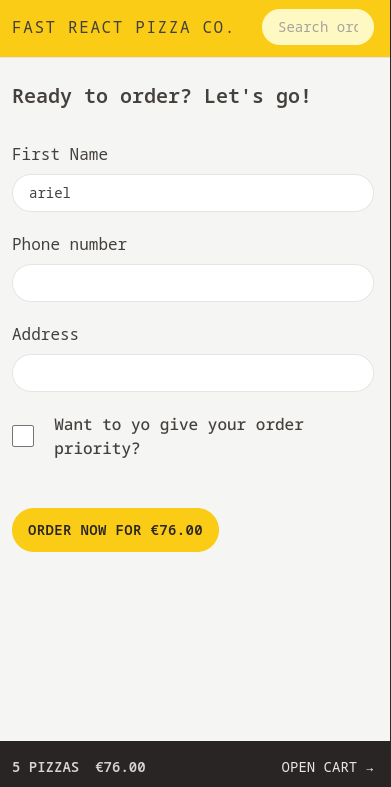

# Fast React Pizza Co.

## What it's about?

Fast React Pizza is simple react application which allows users to order pizzas from a dynamic menu loaded via API. Users input their name, phone number, address, and can optionally use GPS for easier delivery. Multiple pizzas can be added to a cart, with an option to mark orders as "priority" for a 20% price increase. Orders are placed via POST requests, and payments are made upon delivery. A unique order ID is generated, and users can update their order to "priority" even after placement.

## Technologies

- React with JavaScript
- React Router
- Redux
- Tailwind CSS
- Vite

## How is it look?

### Home Page


### Menu Page

#### Without orders in a cart


#### With orders


## Cart view


## Order Form



## Order view


## How to run?

```
cd fast-react-pizza
npm run dev
```
